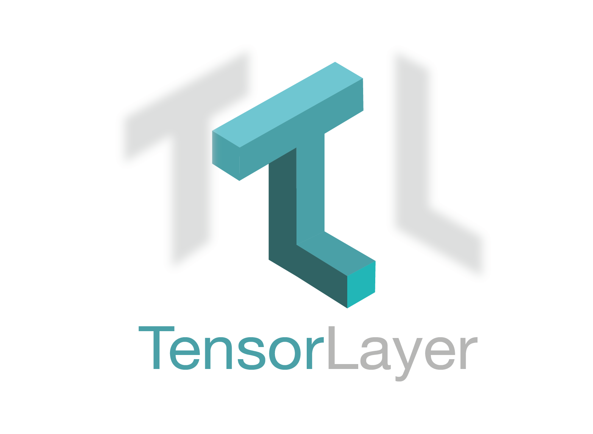

<!--

	

    
   

   

    
    

-->
<a href="http://github.com/zsdonghao/tensorlayer">

	

</a>

TensorLayer是一个崭新的基于[TensorFlow](https://www.tensorflow.org)的深度学习与增强学习开发库。它提供大量的神经网络相关组件和函数来帮助顶尖研究人员和一线工程师解决复杂的人工智能问题。
本仓库维护了TensorLayer的[中文文档](http://tensorlayercn.readthedocs.io/zh/latest)。相对于[英文文档]((https://github.com/tensorlayer/tensorlayer))，中文文档会有一定滞后性。

TensorLayer拥有大量的华人使用者和开发者。官方的中文社群包括了[QQ群](img/img_qq.jpeg)和[微信群](https://github.com/shorxp/tensorlayer-chinese/blob/master/docs/wechat_group.md)进行广泛的讨论。官方英文渠道是[Slack](https://join.slack.com/t/tensorlayer/shared_invite/enQtMjUyMjczMzU2Njg4LWI0MWU0MDFkOWY2YjQ4YjVhMzI5M2VlZmE4YTNhNGY1NjZhMzUwMmQ2MTc0YWRjMjQzMjdjMTg2MWQ2ZWJhYzc)。申请加入这些社群时，请star[官方项目](https://github.com/tensorlayer/tensorlayer)，并告知github用户名。
