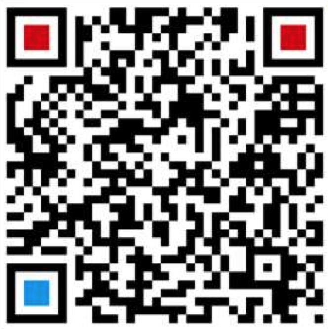
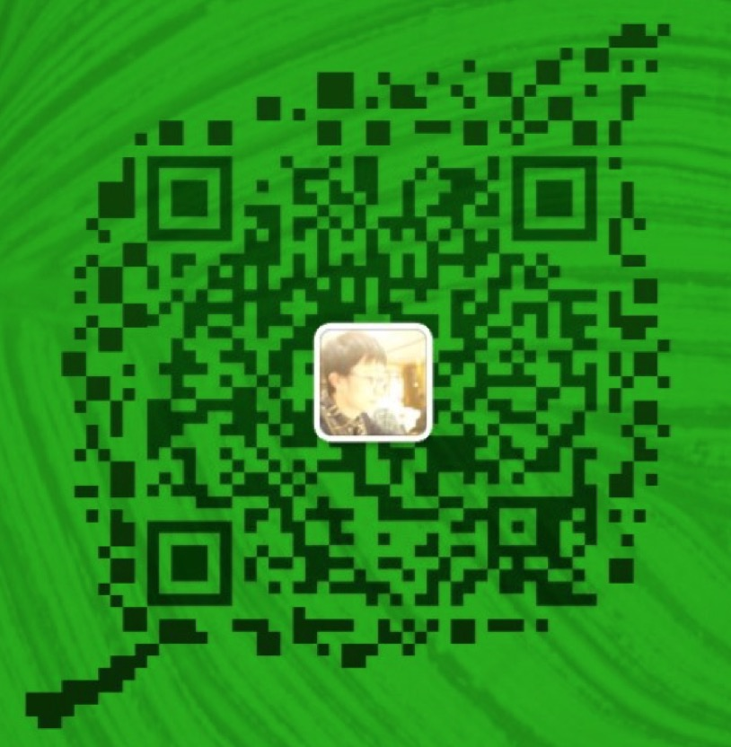
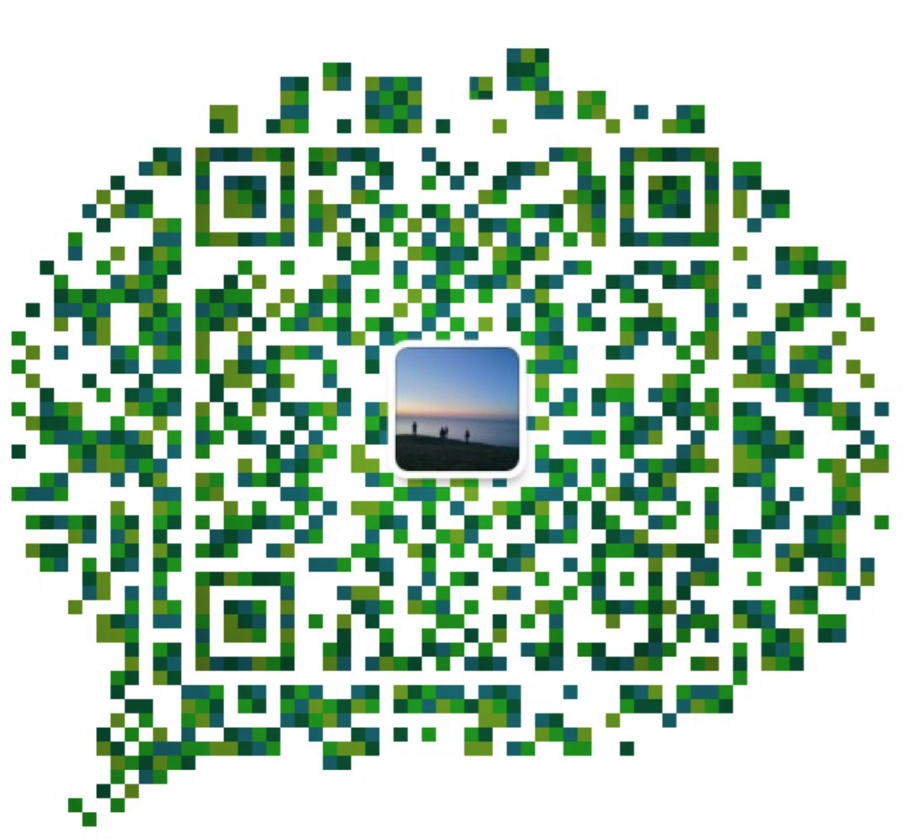

# TensorLayer 交流群介绍
各位，现在 TensorLayer 只有一个大群，一方面是响应大家的号召，一方面觉得大群确实有一定的弊端。但从整体效果来看，在没有专人运营的情况下，子群很快就会沉寂下来，失去了建立子群的意义。     

最近和几位群主商量了一下，希望可以通过一定的运营手段来活跃子群，让子群产生更多的高质量讨论，我们也会定期地组织一些高质量的话题讨论、活动分享甚至是线下聚会。目前，我们准备有以下几个微信子群，请注明科研机构和具体研究方向，入群后改名为（昵称－单位－研究方向） !!

##### ⚠️：二维码7天有效，若过期请通过微信号添加。若在手机微信打开本页面，可先点击二维码图片，再提取二维码。

### 医疗AI：杨光 dr\_g\_yang    

	

### GAN：董豪 zsdh123

	

### CV：于思淼 q86724810

	

### NLP：待定 稍后公布

### DL理论：莫元汉 MO224582

	

